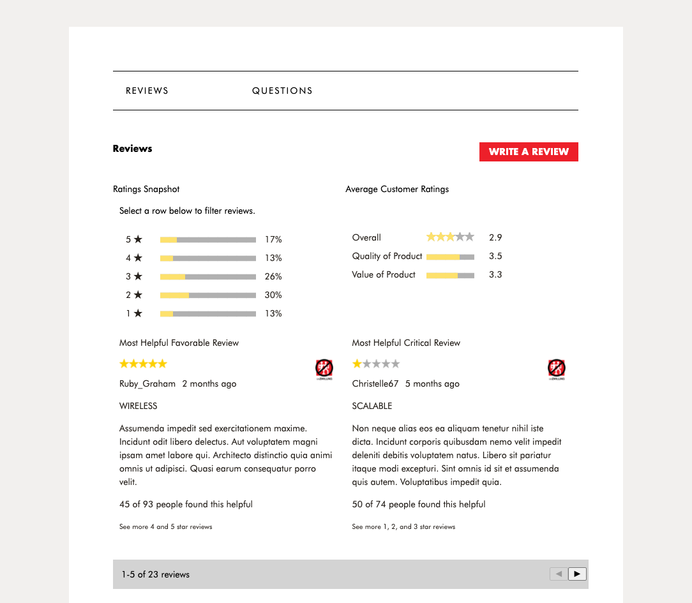
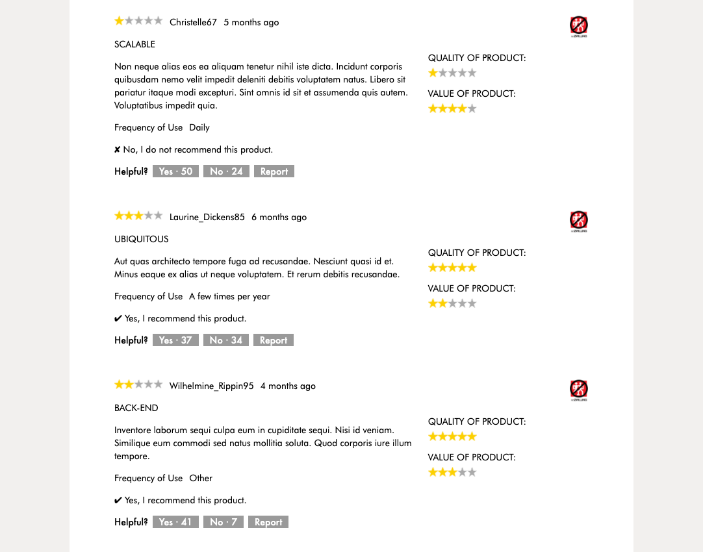
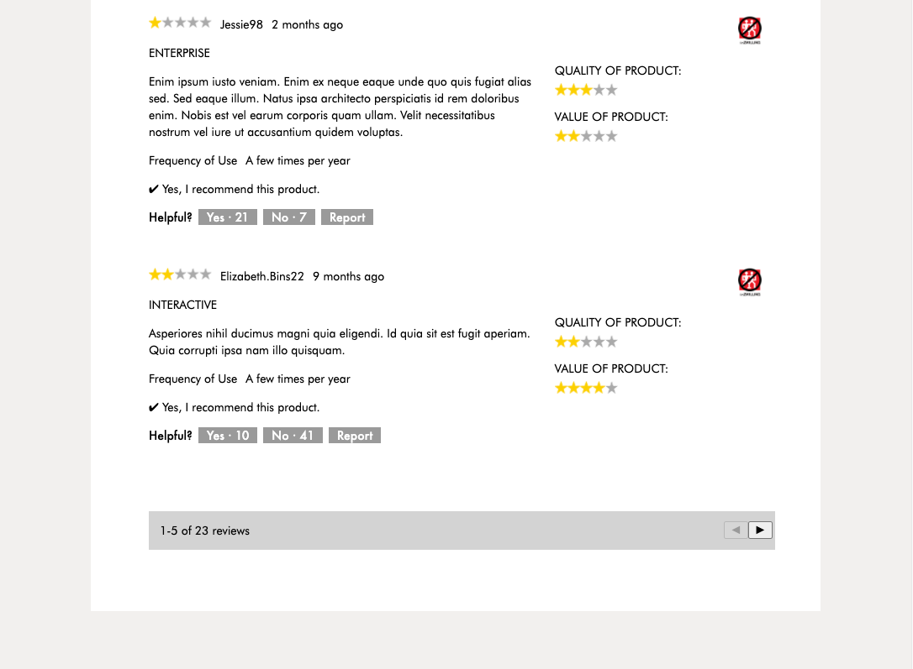
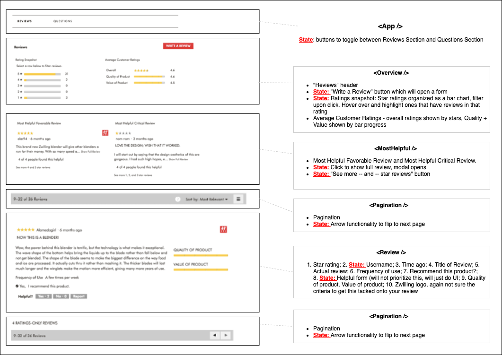

# FEC-UNZWILLING-reviews-section

## REST API for Reviews

## :octocat: ## :computer:

### REST API

| **CRUD** | **Method** 	| **URL** | **Key Parameter** | **Purpose** |
| --- | --- | --- | --- | --- |
| Create | POST | /review | **review\_id** | Add a specific review |
| Read | GET | /review | **product\_id** | Retrieve reviews for a product |
| Update | PUT | /review | **product\_id** | Update a review for a product |
| Delete | DELETE | /review | **review\_id** | Delete a specific review |


### Additional Parameters

| **Parameter** | **Type** | **Description** |
| --- | --- | --- |
| qty | integer | Specify quantity of results to return |
| sort | string | Sort criteria by &#39;highest&#39; or &#39;lowest&#39;  ratings or most &#39;recent&#39; |
| offset | integer | Allows &#39;skipping&#39; over data. Useful for retrieving additional pages of data |


### Data Schema (WIP)

#### Review Schema

```
const **Review** = mongoose.Schema({
  reviewId: Number,
  reviewUsername: String,
  reviewContent: String,
  reviewTitle: String,
  userId: Number,
  reviewDate: Number,
  qualityRating: Number,
  valueRating: Number,
  frequencyOfUse: String,
  starRating: Number,
  reviewRecommended: Boolean,
  helpfulYes: Number,
  helpfulNo: Number,
});
```
#### Review Summary Schema

```
const **ReviewSummarySchema** = mongoose.Schema({
  productId: Number,
  totalNumberReviews: Number,
  averageStarRating: Number,
  averageQualityRating : Number,
  averageValueRating : Number,
  aggregateOneStarReview : Number,
  aggregateTwoStarReview : Number,
  aggregateThreeStarReview : Number,
  aggregateFourStarReview : Number,
  aggregateFiveStarReview : Number,
  mostHelpfulFavorable : Number,
  mostHelpfulCritical : Number,
  reviews** : [Review],
});
```

#### User stories

As user, I want to:

- write a review
- read x qty most recent reviews to find out 1) how the product holds up over time, 2) find out about recent production products
- read highest rated reviews to see why the product is good
- read lowest rated reviews to see weaknesses of product
- update a review
- delete a review

#### Questions For SDC:

- For 10 million records should I:

  - Generate 10 million products with 0-100 reviews each?
  - Or just create 10 million products with 1 review?
  - Or just 10 million reviews?
  
- For schema should I:
  - Use the existing Review Summary schema which stores pre-computed summaries of reviews?
  - Or generate Review Summary on the fly?
  - Or do both and compare results?
  
  :octocat:   :octocat:   :octocat:
  
<!--
## UI update





## File Structure (updated, final)


## Component names (updated)

-->
